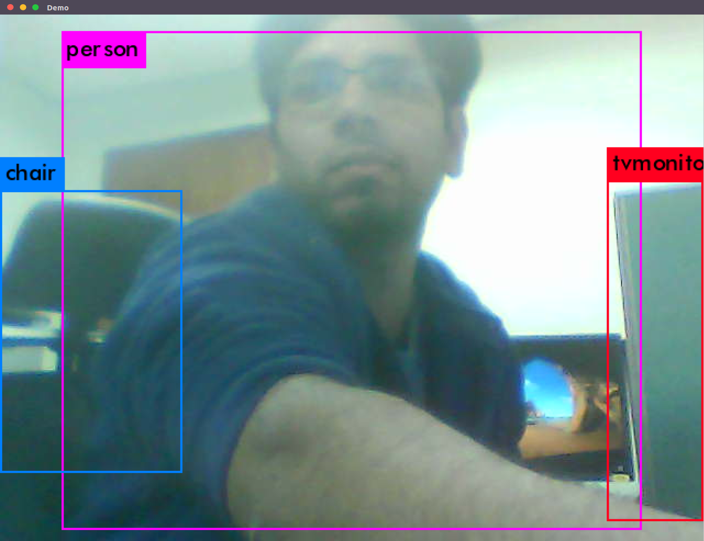

# Object-Detection-with-Jetson-Tx2
This repository present method to implement deep learning based object detection framework ([YOLO](https://pjreddie.com/darknet/yolov2/)) on [Jetson Tx2](https://www.nvidia.com/en-us/autonomous-machines/embedded-systems-dev-kits-modules/) board, which is an embedded system-on-module (SoM). NVIDIA Jetson TX2 is equiped with dual-core NVIDIA Denver2 + quad-core ARM Cortex-A57, 8GB 128-bit LPDDR4 and integrated 256-core Pascal GPU, making it a suitable platform for deep learning applications.

## Contents
1. [Environment](#environment)
2. [Build YOLO](#build-yolo)
3. [Run Detector](#run detector)
4. [Results](#results)


## Environment
We consider that the following is already installed on your Jetson Tx2 board:
  1. Ubuntu 16.x
  2. CUDA and cudNN
  2. OpenCV 3.x (Better to have OpenCV4Tegra which is a CPU and GPU optimized version of OpenCV)
  3. gcc 5.x
(may be I will update this part of the repository with the complete installation of above requirements)

## Build YOLO
First, clone the YOLO from original repository:

```
$ mkdir Jetson-YOLO-V2
$ git clone https://github.com/pjreddie/darknet Jetson-YOLO-V2
$ cd Jetson-YOLO-V2
```

Next, modify the first few lines of Makefile as follows. Note that CUDA architecture of TX2 is “62”, while TX1 “53”.
```
GPU=1
CUDNN=1
OPENCV=1
......
ARCH= -gencode arch=compute_53,code=[sm_53,compute_53] \
      -gencode arch=compute_62,code=[sm_62,compute_62]
```

Now, you can build YOLO using 
```
$ make
```

I hope you don't see any error during the build process :P

Before runing the detector, we suggest you to enable the turbo mode of your Jetson Board by following commands:

```
### set Jetson TX2 to max performance mode
$ sudo nvpmodel -m 0
$ sudo ~/jetson_clocks.sh
```

You will see the fan on your Jetson board starts runing... Waooo!! :P

## Run Detector
Once YOLO is successfully build on your Jetson Board, you can now download the pre-trained weight file from the YOLO website:
```
$ wget https://pjreddie.com/media/files/yolov2-voc.weights # for detecting 20 classes of VOC 2007 and 2012
```

other required files (e.g., voc.data and yolov2-voc.cfg files are already downloading with YOLO repository, and present in [`cfg`](https://github.com/pjreddie/darknet/tree/master/cfg) folder. We consider that you have connected a USB camera with your Jetson Board, and you want to detect objects in the live feed of this USB camera. You can run the following command to start detecting objects with Jetson.

```
$ ./darknet detector demo cfg/voc.data cfg/yolov2-voc.cfg yolov2-voc.weights -c 1
```

where the aurgument `-c 1` means that you want to detect objects from the live feed of your USB camera. After running the above command, you will see the detection results in one window, and the detection speed in frames per second (FPS) in another window. You  will observe a detection speed any where between 7~10 FPS. In order to run faster but less accurate version of the YOLO (TINY YOLO), you can download the weight file and do the detection using following commands:

```
$ wget https://pjreddie.com/media/files/yolov2-tiny-voc.weights
$ ./darknet detector demo cfg/voc.data cfg/yolov2-tiny-voc.cfg yolov2-tiny-voc.weights -c 1
```

Now you will observe the detection speed between 15~19 FPS.
Enjoy!!!

## Results

<div align="center">
    
</div>

<div align="center">
    
</div>
